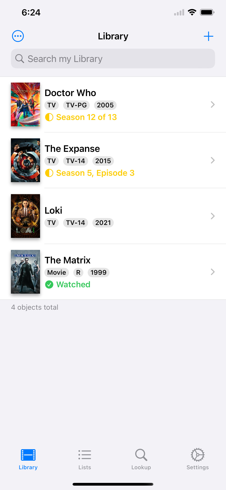
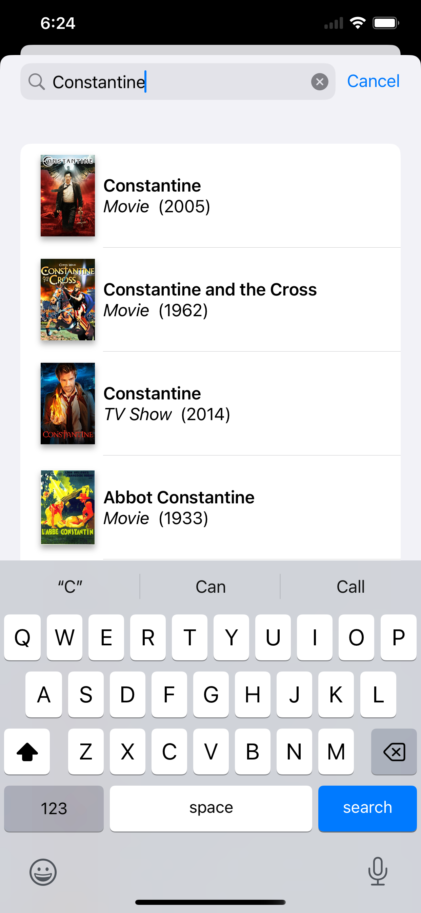
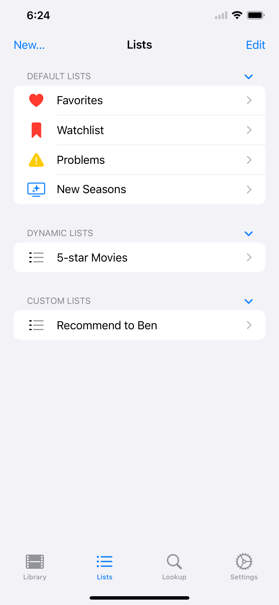
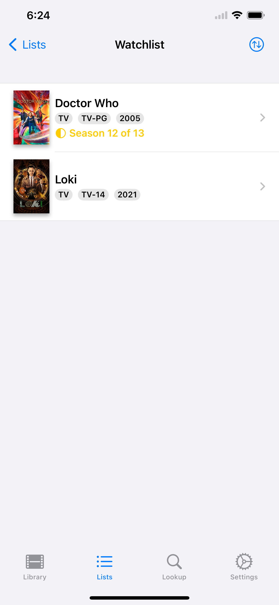
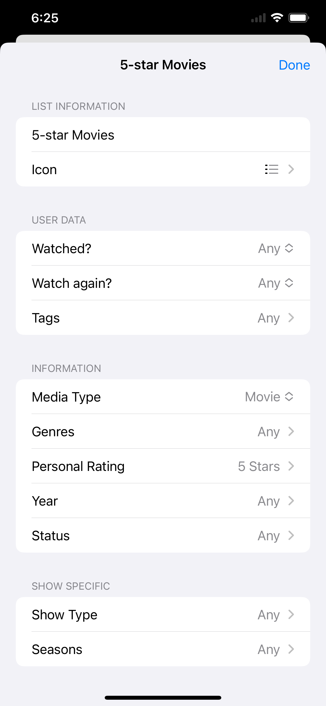
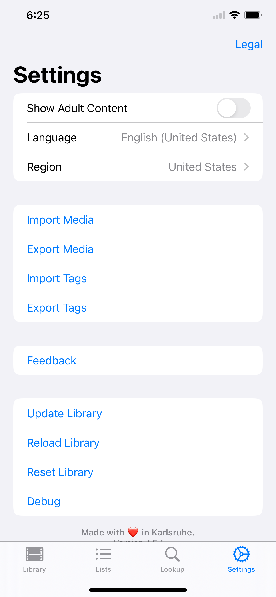

#  Movie DB

An app to keep track of all the movies and shows you watched.

**Download now via [TestFlight](https://testflight.apple.com/join/yI9GMaOD)!**

  
  
  
  
  
  

## Features
* Add movies and tv shows from TheMovieDB.org to your library
* Show Information about your movies / tv shows
* Rate your movies / tv shows with 0 to 5 stars
* Mark them as watched
* Mark whether you would watch them again
* Add custom tags
* Add custom notes
* Update your entries with new information form TheMovieDB.org
* CSV Import/Export (Import requires the ID of the media on TheMovieDB.org and the type of media (movie/tv show))
* iCloud Sync
* Parental Ratings
* Streaming service availability (powered by [JustWatch.com](https://justwatch.com))

## Planned Features
* Embedded trailers
* Marking media as Favorite and creating custom lists
* Notification when a new season is available on your streaming services

## Building
* To build the project, you need to first install [GYB](https://github.com/apple/swift/blob/main/utils/gyb.py) (e.g. via `brew install nshipster/formulae/gyb`)
    * GYB also requires python 2.7 to be installed
* You then need to request your own API key from [TheMovieDB](https://themoviedb.org) (See [Authentication](https://developers.themoviedb.org/3/getting-started/authentication))
* Finally you must provide this API key as a `TMDB_API_KEY` environment variable during build time or as a local file "TMDB_API_KEY" in your project root.
* When you build the project, GYB will read your API key and obfuscate it into a Swift file `Secrets.swift`. You can then access your API key from code with `Secrets.tmdbAPIKey`

## License
Please note, that the project is currently not under any license and therefore "All rights reserved".

If you wish to use parts of my code, feel free to [contact me](mailto:dev@jonasfrey.de).

This app uses data from The Movie Database.
This product uses the TMDb API but is not endorsed or certified by TMDb.
https://www.themoviedb.org
