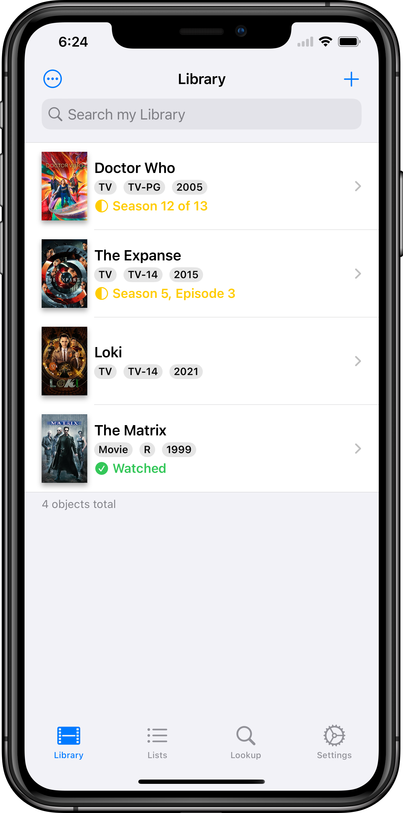
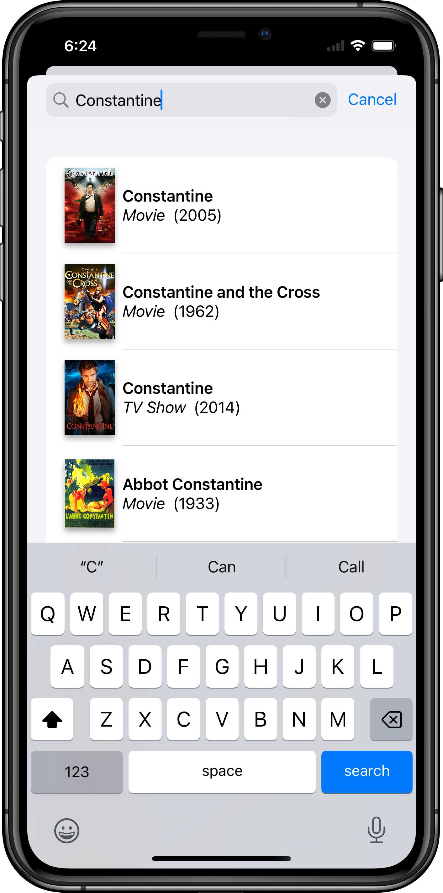
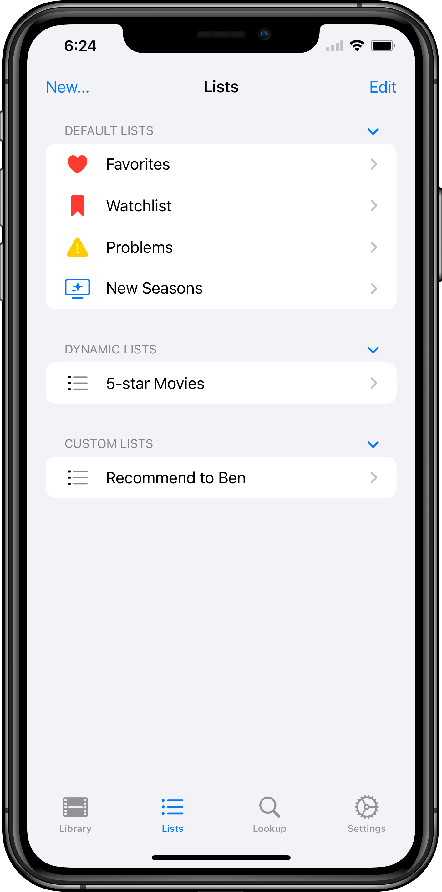
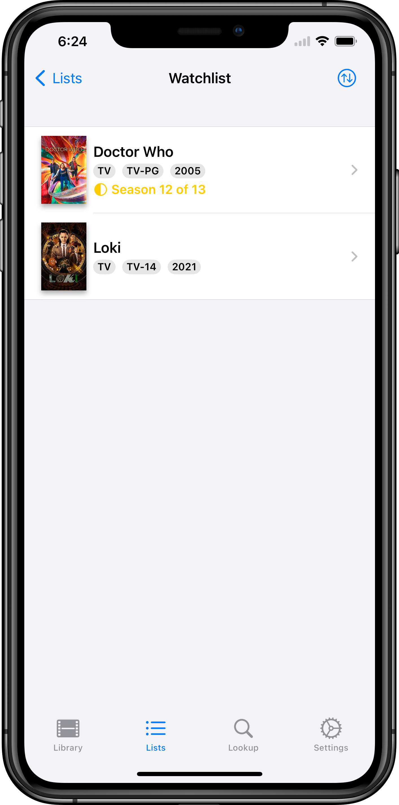
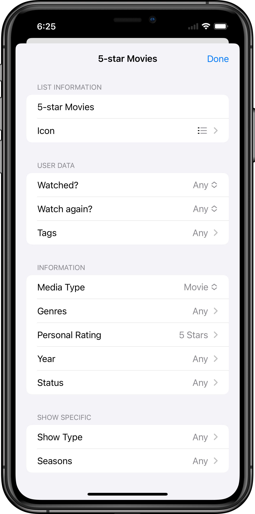
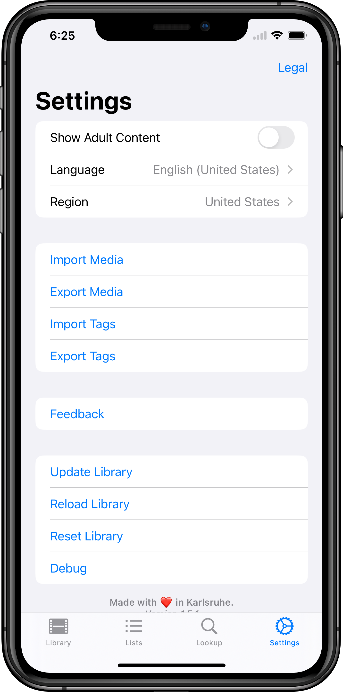

#  Movie DB

An app to keep track of all the movies and shows you watched.

**Download now via the [App Store](https://apps.apple.com/de/app/movie-organizer/id1552079477)!**

Movie DB is the ultimate app for movie and TV show enthusiasts. With this app, you can easily keep track of all the movies and shows you've watched or want to watch and rate them with 0 to 5 stars. You can also mark them as watched and whether you would watch them again.

The app features an integration with TheMovieDB.org, which allows you to add movies and TV shows to your library, and get information about them such as synopsis, cast, release date, trailers, and watch provider availability.

Movie DB also allows you to add custom tags and notes, organize media in your favorites, watchlist, custom lists, and dynamic lists, and keep your library in sync across devices with iCloud. The app also features CSV import/export and tag import/export, making it easy to transfer your library between devices or apps.

With background refresh, TMDB-based metadata updates, universal-link sharing, and optional privacy-friendly analytics, Movie DB helps you keep your movie and TV show collection up to date without getting in your way.

This product uses the TMDB API but is not endorsed or certified by TMDB.

<p align="center">
  
  
  
  
  
  
</p>


## Features
* Add movies and tv shows from TheMovieDB.org to your library
* Search your library or switch to TMDB search to add new media
* Show information about your movies / tv shows
* Rate your movies / tv shows with 0 to 5 stars
* Mark them as watched, add custom tags and notes
* Update your entries with new information from TheMovieDB.org
* CSV Import/Export
* Tag Import/Export
* iCloud Sync
* Background library refresh
* Parental Ratings
* Streaming service availability (powered by [JustWatch.com](https://justwatch.com))
* Mark media as Favorite or Watchlist and organize them in custom lists and dynamic lists
* A list that contains all shows where new unwatched seasons are available
* A list that contains all movies and shows with upcoming release dates
* Trailer links
* Share media with others using a link
* Optional Pro unlock for larger libraries and premium list features
* Explicit opt-in analytics only; the app works fully with analytics disabled

## Building
* To build the project, you need Xcode 16 or newer with the iOS 17 SDK
* You need to first install [GYB](https://github.com/apple/swift/blob/main/utils/gyb.py) (e.g. via `brew install nshipster/formulae/gyb`)
* You then need to request your own API key from [TheMovieDB.org](https://themoviedb.org) (See [Authentication](https://developers.themoviedb.org/3/getting-started/authentication) and [API Settings](https://www.themoviedb.org/settings/api))
* Finally you must create a local `.env.local` file in the project root with the secrets needed during build time:
```sh
TMDB_API_KEY=<TMDB bearer read access token>
POSTHOG_PROJECT_TOKEN=<PostHog project token>
POSTHOG_HOST=https://eu.i.posthog.com
```
* The build also accepts these values as environment variables, which is useful for CI.
* When you build the project, GYB will read these values and obfuscate them into a Swift file `Secrets.swift`. You can then access them from code with `Secrets.tmdbAPIKey`, `Secrets.postHogProjectToken`, and `Secrets.postHogHost`.
* Additionally, you will also need a GitHub personal access token as a `GITHUB_API_KEY` environment variable during build time or as a local file `GITHUB_API_KEY` in your project root. This token will be used by [LicensePlist](https://github.com/mono0926/LicensePlist) to download the licenses of the packages you use.
* PostHog credentials are required for local builds, but analytics remain disabled until the user explicitly opts in at runtime.

---

This product uses the TMDb API but is not endorsed or certified by TMDb.
https://www.themoviedb.org
