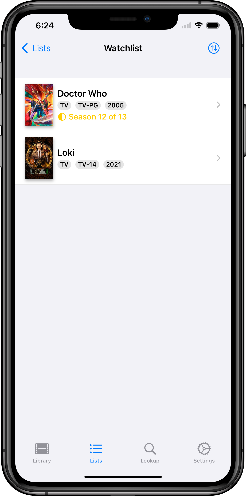

#  Movie DB

An app to keep track of all the movies and shows you watched.

**Download now via [TestFlight](https://testflight.apple.com/join/yI9GMaOD)!**

Movie DB is the ultimate app for movie and TV show enthusiasts. With this app, you can easily keep track of all the movies and shows you've watched or want to watch and rate them with 0 to 5 stars. You can also mark them as watched and whether you would watch them again.

The app features an integration with TheMovieDB.org, which allows you to add movies and TV shows to your library, and get information about them such as synopsis, cast, release date and budget.

Movie DB also allows you to add custom tags and notes, making it easy to organize your library and find the movies and shows you want to watch again. The app also features a CSV import/export function, making it easy to transfer your library between devices or apps.
The import function requires at least the TMDB ID of the media and the type of media (movie/show).

With iCloud Sync, your library is always up-to-date on all of your devices. The app also features parental ratings and streaming service availability powered by JustWatch.com, making it easy to find family-friendly content and know where you can watch your favorite shows.

Don't miss out on keeping track of your movie and TV show collection!

This product uses the TMDB API but is not endorsed or certified by TMDB.

  
  
  
  
  
  

## Features
* Add movies and tv shows from TheMovieDB.org to your library
* Show Information about your movies / tv shows
* Rate your movies / tv shows with 0 to 5 stars
* Mark them as watched
* Mark whether you would watch them again
* Add custom tags
* Add custom notes
* Update your entries with new information form TheMovieDB.org
* CSV Import/Export (Import requires the ID of the media on TheMovieDB.org and the type of media (movie/tv show))
* iCloud Sync
* Parental Ratings
* Streaming service availability (powered by [JustWatch.com](https://justwatch.com))
* Marking media as Favorite and creating custom lists

## Planned Features
* Embedded trailers
* Notification when a new season is available on your streaming services

## Building
* To build the project, you need to first install [GYB](https://github.com/apple/swift/blob/main/utils/gyb.py) (e.g. via `brew install nshipster/formulae/gyb`)
    * GYB also requires python 2.7 to be installed
* You then need to request your own API key from [TheMovieDB](https://themoviedb.org) (See [Authentication](https://developers.themoviedb.org/3/getting-started/authentication))
* Finally you must provide this API key as a `TMDB_API_KEY` environment variable during build time or as a local file "TMDB_API_KEY" in your project root.
* When you build the project, GYB will read your API key and obfuscate it into a Swift file `Secrets.swift`. You can then access your API key from code with `Secrets.tmdbAPIKey`

---

This product uses the TMDb API but is not endorsed or certified by TMDb.
https://www.themoviedb.org
